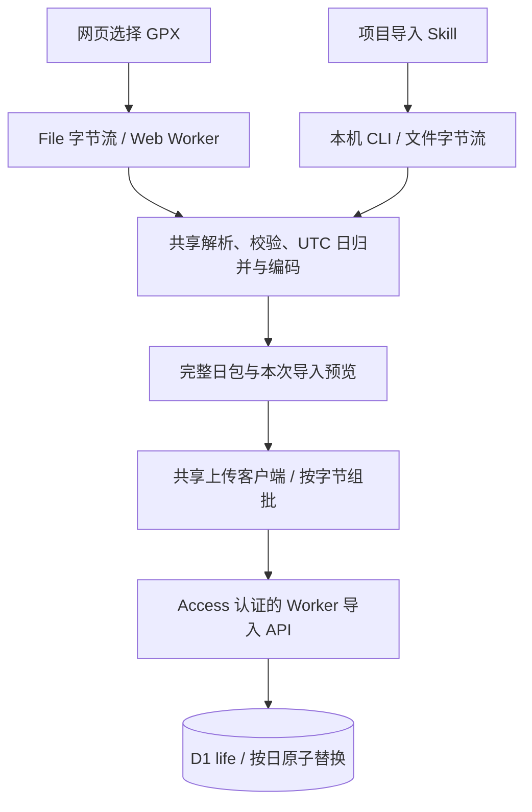

# 15 数据管理与 Footprint 导入

日期：2026-09-14。状态：**方案已获批准，1.3.0 实现完成，正在进行发布与生产数据核验**。完整生产结果在本文末尾记录；下方保留选型测量与最终契约。

用户要求新增“数据管理”分区，将累计统计和每个 provider 的导入操作分开；网页和本机脚本使用同一套导入逻辑。Footprint 明确采用 **同一来源、同一 UTC 日，后一次导入整日替换前一次**。这取代 [14 Footprint 分析](14-footprint-import-analysis.md) 初稿中的新旧点合并建议。

## 存储选择与渲染实测

采用 **一 UTC 日一行、紧凑 JSON 数组**。普通对象和紧凑数组都是 JSON，都会把这份文件的 670,191 个点存成 1,625 个日包。数组通过省去逐点重复的字段名和日期字符串减小正文，保留全部点和数值。

| 指标 | 普通 JSON 对象日包 | 紧凑 JSON 数组日包 |
| --- | ---: | ---: |
| 轨迹数据行 | 1,625 | 1,625 |
| 全量本地 SQLite 实测占用，含日包索引和摘要 | 80.30 MB | **29.29 MB** |
| 最大 UTC 日包正文，3,535 点 | 417,544 bytes | **148,809 bytes** |
| 典型 UTC 日，349 点：解析、解码及现有日视图分析 | 0.30 ms | 0.38 ms |
| 最大 UTC 日，3,535 点：同上 | 3.06 ms | 3.94 ms |
| 最密集上海本地日，读取两个 UTC 日包：同上 | 3.32 ms | 4.28 ms |
| 最大 UTC 日的 Leaflet 同步场景创建 | 0.60 ms | 0.60 ms |

普通对象在前端处理上略快。紧凑数组在最大 UTC 日多用约 0.88 ms，整体存储减少约 63.5%；符合当前优先紧凑存储的取向。模型层读取后解码一次，地图、小时分布和故事线继续使用明确的点对象，不在 React 每次 render 时重复解码。

测量使用此文件的真实日包、Google Chrome 152.0.7977.83、现有 [buildDayInsights](../src/models/day-insights.ts) 和 Leaflet Canvas，画布为 720 × 360。两种表示在三个样本中生成的完整 `DayInsights` 均相同，没有页面脚本错误。处理耗时经过预热，取 41 组循环的中位数；地图场景创建取预热后 12 次的中位数。这里测量的是 JavaScript 处理和同步场景创建，**不包含 D1 请求、HTTP 传输、瓦片加载或整页绘制**。HTTP 压缩还会影响实际传输大小，不能把正文缩小比例当成页面加速比例。

实验脚本和完整结果保存在本机 `/tmp/life-data-management-plan-20260914/`；原始存储实验位于 `/tmp/life-gpx-analysis-20260914/`。上表是本地候选表实测，最终迁移增加的少量元数据和线上 D1 页占用需要实现后核验。

两种 JSON 日包的行数相同。选型实验的 3,250 次行写入仅包含日包及复合主键索引，**不是最终导入总计量**；实现还会写入来源、统计触发器和导入会话。相同日包跳过数据内容写入，但成功导入时间、会话回执等仍会更新。存储成本必须使用最终 D1 物理占用，不能以 payload 字节替代。Paid 超额单价为写入 $1/百万行、存储 $0.75/GB·月；剩余账户额度内不产生相应额外费用。原始测量与额度边界见 [14](14-footprint-import-analysis.md)。

## 页面划分

侧边栏新增 Basalt `SidebarPartition`：

```text
数据管理
  数据概览       /data
  Footprint      /data/footprint
```

展开侧边栏、折叠图标导航和命令面板使用同一组导航定义。沿用现有 logo 的固定位置，以及底部 lizheng.blog 头像、名字和版本布局。

**数据概览**以 provider 对照表为主体，宽屏直接展示关键指标；可展开查看按年月排列的覆盖日期，便于发现缺失日。累计统计统一放在这里。

| 统计项 | 口径与 Footprint 示例 |
| --- | --- |
| 覆盖天数 | 存在记录的 UTC 日期数；本文件为 1,625，不是首末日期之间的 1,753 天，也不是上海本地的 1,613 天 |
| 时间范围 | 最早和最晚原始记录的 UTC 瞬间；界面按用户当前时区显示，并明确 UTC 覆盖日口径 |
| 原始记录数 | 当前有效数据包含的点或记录数；Footprint 为 670,191，重导不会累计相加 |
| 实际数据行 | 该 provider 实际占用的数据表行数；日包为 1,625，索引条目和共享元数据另计 |
| 数据正文大小 | 当前 payload 的 UTF-8 字节数；最终紧凑日包正文合计 27,719,570 bytes |
| 最近导入 | 最近完整成功导入时间、网页或本机渠道；与“最近内容变更”分别记录 |
| 存储方式 | Footprint 显示“按 UTC 日保存”；其他 provider 按实际结构展示 |

“数据正文大小”不能标成精确的“D1 物理占用”：数据库页和索引开销无法用各 provider 的 JSON 长度精确分摊。完整数据库的物理大小如果展示，应作为独立的数据库指标。多个 provider 的覆盖天数存在重叠，全局覆盖天数必须取日期并集，不能直接求和。

其他已导入 provider 同样出现在概览中，首版读取其现有结构；不在缺少原始样本的情况下强行改成 Footprint 日包。覆盖统计遵循各 provider 的 UTC 记录窗口，区间记录按实际跨越日期计算。

**Footprint 页面**负责本次任务：选择或拖入 GPX、解析进度、文件日期范围与点数预览、整日覆盖说明、提交进度、取消和结果。累计覆盖天数、累计空间等不在这里重复堆放。解析完成后明确展示：“此次文件包含的 UTC 日期将整日替换，文件未包含的日期保留”。

旧 `/imports` 的选择项、提示文案和上传逻辑已移除 Footprint；服务端对旧 Footprint 逐点写入返回 `410 footprint_import_moved`。Apple Health、貔貅、日记暂时保留原入口；后续分析各自样本后，再逐个转成独立 provider 页面。

## 日包结构

迁移 `worker/migrations/0003_provider_days.sql` 中的 `provider_days` 结构：

```text
source_id       sources 中的来源 ID
utc_day         UTC 零点，epoch 毫秒
record_count    本包原始点数
first_at        最早记录，UTC epoch 毫秒
last_at         最晚记录，UTC epoch 毫秒
payload_bytes   data_json 的 UTF-8 字节数
summary_json    小型摘要，例如 24 个 UTC 小时的点数
data_json       带版本的 provider 专属 JSON
content_hash    规范化内容的 SHA-256
updated_at      本包内容最近实际变更时间
PRIMARY KEY (source_id, utc_day)
```

Footprint 的 `data_json` 使用固定字段顺序。下面的坐标是虚构示例：

```json
{
  "v": 1,
  "fields": ["offsetSeconds", "latitude", "longitude", "elevation", "speed", "course"],
  "points": [[3600, 0, 0, 10.25, -1, 0]]
}
```

`offsetSeconds` 从所在 UTC 日零点开始计数。本样本精确到秒，未做时间取整；支持毫秒小数，更细的非零小数位明确报错，不能默默截断。数据库时间列继续统一使用毫秒。

经纬度不舍入，负海拔保留；`speed=-1`、`course=-1` 保留原值，在派生指标中视为无效。缺失的可选数值用 `null`，不伪造为零。同一时间戳的不同点保留，不仅凭时间戳去重。本文件自身没有重复点，整日替换已经解决重复导入造成的累积问题。

日包以可选 `breaks` 索引数组保留多个原始轨迹段的边界；地图同时遵守原始断点、超过 30 分钟的空档和现有跨日期变更线断线规则。不能把一个跨数年的 GPX 段理解成连续出行。

这是 Footprint 的日包契约。其他 provider 可以使用自己的 payload 与适合的存储粒度，共享导入操作和统计接口即可。

## 整日替换与幂等性

例如第一次导入在 UTC 9 月 10 日有 300 个点，第二次文件在同日只有 200 个点，提交后该日仍为 **一行、200 个点**。第二次文件没有 9 月 9 日，就不改变 9 月 9 日。

1. **归并本文件，再替换数据库中的整日。** 这份 GPX 有 126 次时间倒退，必须收集同一天在文件各处出现的全部点，确定输入解析完整后再提交。不能每遇到一次换日就覆盖。解析错误、非法点或超限日包在提交前报告，不能静默丢点后覆盖旧日。
2. **按稳定顺序生成日包和哈希。** 同一批内容即使文件顺序不同，也得到同一份日包。文件名、导入时间、解析进度不进入内容哈希。
3. **只比较当前日包内容。** 当前哈希相同就跳过数据写入，也不更新日包 `updated_at`。A → B → A 三次导入后必须恢复 A，不能因 A 曾经导入过而全文件跳过。
4. **每个日包原子替换。** 不先删除旧点再逐点补写。批次提交成功才确认对应日包；网络中断后，已成功的日包保留，未提交的日期保留原数据，重试可以补齐。首版不承诺整份五年文件的全局事务。
5. **网页和 CLI 按 provider 串行提交。** 服务端颁发短期导入会话，冲突时返回正在导入的状态。两端按批次顺序提交；当前批次响应丢失时，用相同批次 ID 取得已确认结果，已经过时的批次不再次写入。每次写入在数据库操作中原子核验会话及有效期，过期旧任务不能覆盖后来的导入。会话只需每个 provider 一条小记录，保存当前进度和最近批次结果，不为每个点建立任务行。
6. **导入身份与内容分别记录。** 相同内容重导可以更新“最近导入”，但不会使数据行或 AI 输入产生假变化。成功与中断状态区分展示，不把部分完成写成整份导入成功。

文件没有出现的日期不表示删除；首版不把空文件或缺失日解释为清空指令。未来时间按同样的 UTC 键处理，没有“不得导入未来”的限制。

## 网页和本机共用的模块

将 Footprint 的解析、验证、日归并和编码抽成纯 TypeScript 模型。核心入口接受异步字节流，以及取消信号和进度回调；不依赖浏览器 `File`、文件路径、React、HTTP 或 D1。复用现有 Saxes 流式 XML 解析能力，无需新增解析框架。



浏览器将解析放在 **Web Worker**，在页面显示进度并支持取消。完整原始 XML 不进入 Cloudflare Worker；浏览器整理好日包后，分批上传。大数组留在后台线程，只回传进度、预览和有界批次，避免给主线程复制全部点。

本机 CLI 使用同一个核心读取本地文件，经过同一个上传客户端调用生产 Worker。它不需要在网页里选择文件，也不需要把 D1 管理凭据交给脚本。Skill 只负责调用 CLI、选定文件和目标、解释结果，保留唯一一份解析和写入规则。

已实现的命令（Skill 入口为 `skills/life-data-import/SKILL.md`，本机已安装同名 skill）：

```sh
# 本地解析、校验、查看日期与点数，不提交数据
bun run data:import --provider footprint --file ~/Downloads/backUpData-all.gpx --dry-run

# 本机文件导入生产数据集
bun run data:import --provider footprint --file ~/Downloads/backUpData-all.gpx --target production

# 导入独立的本地开发数据库
bun run data:import --provider footprint --file /path/to/example.gpx --target local
```

写入要求显式目标，CLI 启动时打印目标域名和数据环境，并核对服务端提供的绑定目标标识。`local` 必须验证实际连接的是本地数据库；当前 `dev:prod` 虽然使用 Caddy 本地域名，绑定的仍是生产 D1，必须标为生产目标，不能因 URL 包含 `dev` 就误判。网页使用当前部署配置对应的数据集，并显示清晰的目标说明。

流式解析不加载整个 XML 字符串，但为了处理乱序，归并阶段仍保留本文件的点，整体内存随点数增长。2026-09-14 在 Chrome 152、Caddy 地址、1920×1080 下选择完整 160,076,209-byte 文件，约 2.46 秒显示 670,191 点 / 1,625 日预览，没有写请求或脚本错误；50 ms 主线程定时器最大间隔约 80 ms。每 500 ms 采样的独立 Chrome 进程 RSS 合计从约 1.15 GB 到峰值约 1.56 GB，这包含浏览器、渲染器及后台线程，不等于解析器 JS 堆大小，也不是跨设备性能保证。单日包超过 512 KiB 时明确报错；后续更大文件确有需要时再增加临时存储归并。

### 本机认证

依据 2026-09-14 核对的官方 [Access CLI 文档](https://developers.cloudflare.com/cloudflare-one/tutorials/cli/)，首版复用当前用户的 Access 身份：

```sh
cloudflared access login https://life.hexly.ai
```

CLI 在内部调用 `cloudflared access token -app=https://life.hexly.ai` 取得应用 token，通过 `cf-access-token` 请求头发送到 `life.hexly.ai`。Access 校验后向 Worker 提供 `Cf-Access-Jwt-Assertion`，Worker 继续验证签名、issuer、aud、exp 和 sub。token 不写入 URL、日志或命令行参数。

直接访问生产主域名时需要已安装并登录的 `cloudflared`，CLI 对缺失命令或登录失效提供明确指引。本次全量导入使用用户已授权的 `bun run dev:prod`，通过本机服务直接绑定生产 D1，无需新增认证凭据；必须传入 `--target production --base-url http://127.0.0.1:7011`。

管理导入继续使用 Access 保护的主域名。`life.worker.hexly.ai` 维持 Connect ingest 和健康检查的边界；现有 Connect token 的权限仍是自己的 UTC 小时快照，不能用于替换整个历史数据集。

## API、统计与读取

端点均位于 Access 保护的应用域名：

| 端点 | 用途 |
| --- | --- |
| `GET /api/data/target` | 返回实际绑定数据环境 `local`、`production` 或 `test` |
| `GET /api/data/overview` | 返回各导入 provider 的累计统计及数据更新时间 |
| `POST /api/data/footprint/imports` | 解析完成后创建导入会话 |
| `PUT /api/data/footprint/imports/:id/batches/:batchId` | 有界批次提交完整日包，返回各日结果 |
| `POST /api/data/footprint/imports/:id/finish` | 标记完成或部分中断并释放会话 |
| `GET /api/data/footprint/days?start=…&end=…` | 按 UTC 窗口读取相交日包 |

服务端重新验证日键、所有点的日期归属、数值范围、排序、版本和字节上限，重新计算摘要及内容哈希。不能直接信任客户端传入的统计或哈希。

每批最多 32 日，序列化请求体至多 768 KiB，单个完整日包至多 512 KiB；现有 Worker 的 1 MiB 请求硬上限可以保留。限制按实际 UTF-8 字节检查。本样本最大紧凑正文约 149 KB，足够容纳包元数据。超过日包预算时在预览阶段报告日期，不截断，也不偷偷切换为逐点写入。通用导入接口的 32 KiB 单记录限制不适用于此专用日包接口。

统计直接来自当前有效数据。Footprint 汇总日包的点数、大小和时间列，不读取或 `json_each` 展开 670,191 个点。累计统计采用每 provider 一条可失效的快照：实际数据变更时在同一事务标记 revision，概览只在 revision 改变后重算；旧结构的 provider 也避免每次打开概览扫描全历史。统计更新需对应同一 revision，不能把并发导入前的结果标为最新。无需逐点更新复杂计数器。

时间线使用的 `/api/sources` 读取 `provider_state` 的计数及带索引的时间边界，已移除每次换日触发的全历史 `COUNT/MAX`。Footprint 日读取命中 `(source_id, utc_day)`。其他逐条事件查询同步验证时间范围索引的使用，避免保留 [14 中测得的全扫描](14-footprint-import-analysis.md)。

## 每日视图和 AI 的衔接

用户选择本地日期后，先按真实用户时区得到当天的 UTC 半开窗口，再查询相交的 UTC 日包，解码、合并排序并裁切。通常需要一至两个日包，不能硬编码只读一个 UTC 日期，也不能用固定 24 小时替代时区的日边界计算。

例如上海 2026-09-14 对应 `[2026-09-13T16:00:00Z, 2026-09-14T16:00:00Z)`。展示只使用该范围内的点；存储分包不会把这些点变成一个 `precision=day` 事件。

每日地图、小时轨迹、原始点展开、来源过滤和时间线分栏继续保留。空档不推断为静止，段间不连直线，窗口外点不计入本日距离和点数。包只在读取或内容变化时解码，供地图与时间线共同使用。

AI 继续以完整的本地日窗口为证据。新鲜度哈希依据窗口内实际内容，而非文件名、导入时间或整个相交 UTC 日包的哈希；同一日包中窗口外的点变化不应使本日总结失效。

## 旧数据切换与实施顺序

发布前只读盘点确认生产 `sources=0`、`life_events=0`，无需转换遗留 GPS 行。已在本机私密目录保存完整迁移前导出。新读取会排除已有日包日期的旧点；成功写入某日包时，在同一事务清理该日旧 Footprint 行，未被本次文件覆盖的旧日期保留。

读路径对每个 UTC 日只选择一种有效表示，避免旧点与新日包重复绘图或计数。完成核验后清理已成功转换的旧 Footprint 行，保留可恢复的迁移前数据；仅增加日包而保留全部旧点不能实现存储节省。清理前，概览要反映真实仍占用的数据行数。

实现分工与入口：

1. `src/models/footprint.ts`：共享流式解析、UTC 日归并、规范编码、校验与解码。
2. `worker/footprint-imports.ts`、`provider-overview.ts`、`footprint-read.ts`：日包事务、五分钟租约、重复批次回执、当前统计与索引读取。
3. `worker/events.ts` 在首个事件分页返回 `footprintDays`；事件服务解码合并，保留每日地图、重复点和原始断点。AI 以裁切后的真实点内容计算新鲜度。
4. `/data` 和 `/data/footprint` 使用独立 ViewModel；累计统计与本次任务分开，覆盖日历可跳转到 `/?day=YYYY-MM-DD`。
5. `src/services/footprint-client.ts` 由网页后台线程和 `scripts/import-data.ts` 共用；按序列化 UTF-8 体积组批，瞬时错误重试相同批次，失败时有界取消租约。
6. 发布使用现有 `bun run deploy`，完成全部质量检查后应用迁移并部署；生产数据和发布回执单独核验。

关键验证覆盖：乱序文件、同文件重导、不同内容整日覆盖、A → B → A、缺失日期保留、同时间戳不同点、非法或超限输入、上传中断与重试、网页/CLI 会话冲突、旧会话延迟到达、统计减量与缓存失效、跨 UTC 日和夏令时窗口、地图断点、AI 输入不变、旧数据迁移无丢失无重复、旧 Footprint API 关闭和 ingest 域名隔离。

新逻辑遵守项目现有 L1 ≥95% 四项覆盖率、G1、L2、L3、G2 和隔离数据库要求。合成边界数据进入测试；真实 GPX 只在本机作为容量和保真验证输入，不提交坐标或原始导出到仓库。

## 发布前质量核验

- L1：38 个文件、677 项测试通过；statements 99.02%、branches 97.12%、functions 98.31%、lines 98.99%。使用真实 SQLite 验证事务与租约，合成样本验证边界，不连接生产数据库。
- G1：web、Worker、工具和测试 strict TypeScript 通过；Biome 137 个文件零错误、零警告。
- L2：22 个场景、全部 20 个方法/路径契约，真实本地 Worker 与独立 SQLite 通过。
- L3：15 个浏览器场景通过，包括网页上传、重导不变、整日减量替换、覆盖日历跳转地图、非法日期恢复、折叠导航、无障碍检查及原有宽屏时间线、GPS/AI 功能。
- G2：工作树 gitleaks 与 402 个锁定依赖的 OSV 扫描通过；生产 Vite bundle 构建通过。
- 完整原档核心核对：670,191 个点、1,625 UTC 日的六项数值与独立 Python/SQLite 参考数据逐点一致。最终正文 27,719,570 bytes，最大正文 148,794 bytes，最大单日完整 envelope 149,088 bytes。生产导入完成后再次核验全部数据。
